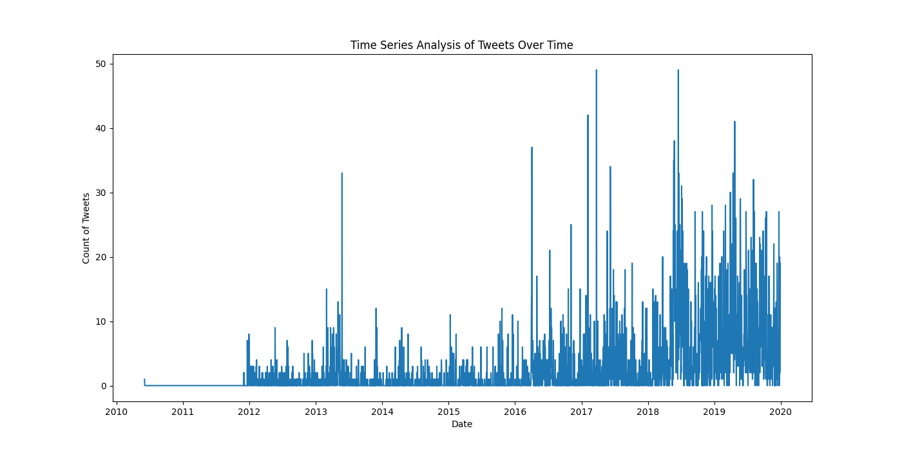

# Detailed Report on Tweet Analytics

This report summarizes the analysis conducted on a dataset of tweets. Various machine learning techniques, including cluster analysis and outlier detection, were applied, alongside a correlation analysis and a time series analysis of tweet activity over time. Here, we present our findings on tweet engagement behavior and anomalies.

## 1. Cluster Analysis (K-Means)

### Cluster Centers

The K-Means clustering revealed three distinct clusters based on user engagement metrics:

- **Cluster 0**:
  - Average Likes: 6073.3
  - Average Replies: 224.2
  - Average Retweets: 689.8
  - Number of Members: 7852
- **Cluster 1**:
  - Average Likes: 420333.9
  - Average Replies: 7712.0
  - Average Retweets: 79918.5
  - Number of Members: 50
- **Cluster 2**:
  - Average Likes: 112656.5
  - Average Replies: 2389.9
  - Average Retweets: 13900.1
  - Number of Members: 410

This clustering indicates a significant variance in engagement, with a small group exhibiting exceptionally high engagement metrics compared to the majority.

### Visual Representation

## 2. Outlier Detection (Isolation Forest)

Using the Isolation Forest algorithm, a total of **416 outliers** were identified based on engagement levels (likes, replies, retweets). Here are a few notable outliers:

| Tweet ID            | Likes  | Replies | Retweets |
| ------------------- | ------ | ------- | -------- |
| 1210775790440177664 | 61186  | 2498    | 2559     |
| 1210649166407438336 | 102519 | 2089    | 5999     |
| 1205680930779590657 | 434980 | 4208    | 59160    |
| 1205415857897164800 | 722781 | 4630    | 124004   |

These figures suggest that while the majority of tweets have lower engagement, a few tweets gather disproportionately high interaction.

### Visual Representation

## 3. Correlation Analysis

The correlation matrix revealed impressive relationships between different metrics:

- **Likes and Retweets**: Strong positive correlation (0.897).
- **Likes and Replies**: Moderate positive correlation (0.706).
- **Retweets and Replies**: Moderate positive correlation (0.649).

These correlations suggest that as likes increase, both retweets and replies tend to rise, indicating interactions are interconnected.

### Visual Representation

## 4. Time Series Analysis

Analyzing the tweet frequency over time yielded the following statistics:

- **Total Tweets**: 3495
- **Mean Daily Tweets**: 2.38
- **Max Daily Tweets**: 49
- **Std Deviation**: 4.88
- **Median Daily Tweets**: 0

This indicates that while there are days with considerable activity, many days show minimal engagement, possibly reflecting sporadic tweeting behavior among users.

### Visual Representation

## Conclusion

This analysis highlights significant disparities in tweet activity and engagement. Outlier detection has pinpointed key tweets with abnormally high engagement, while cluster analysis groups tweets into three distinct categories based on user interaction. The correlation analysis provides insights into how these interactions relate to each other, and the time series analysis shows patterns over time.

Future research could explore the content of these outlier tweets to understand better the factors contributing to their elevated engagement.
