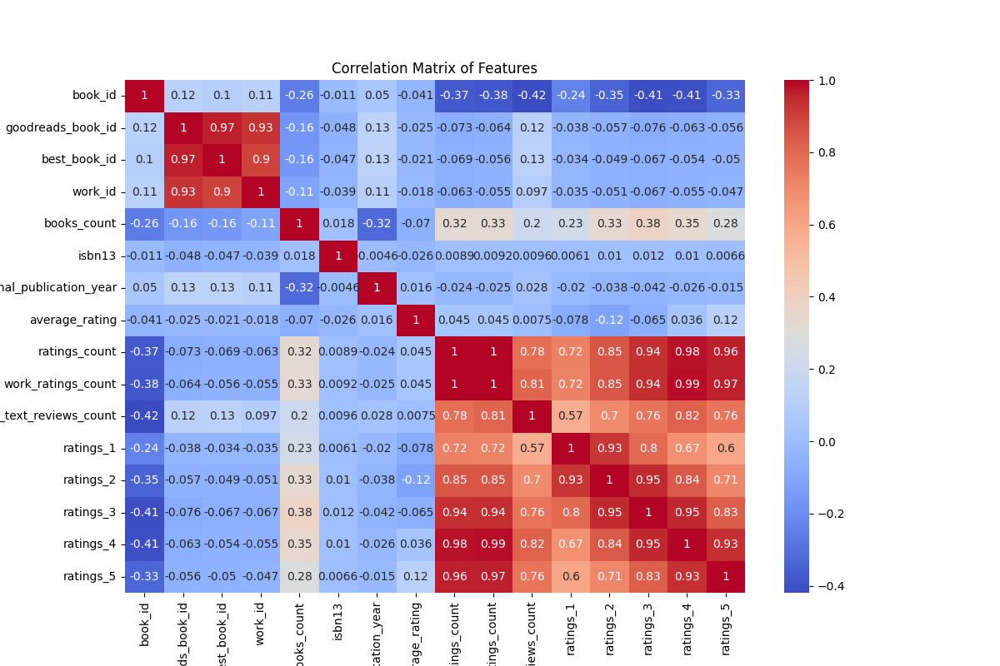
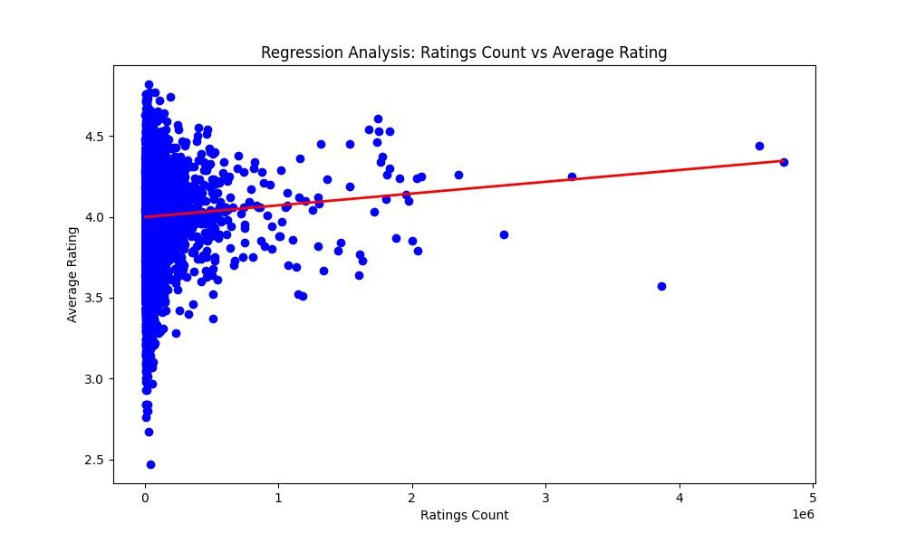
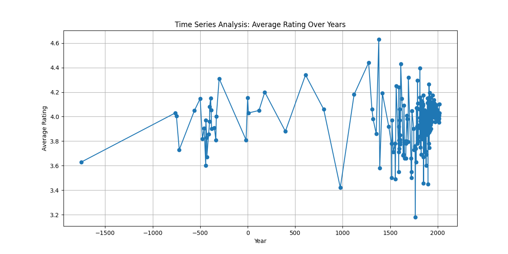
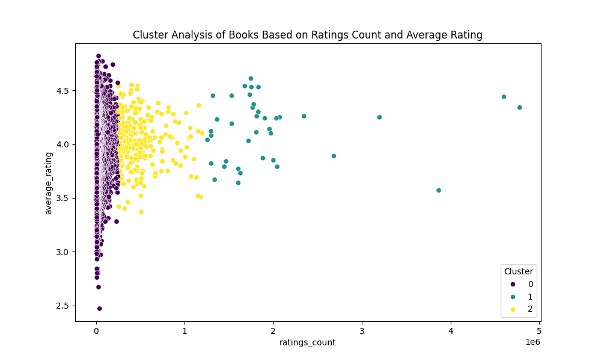
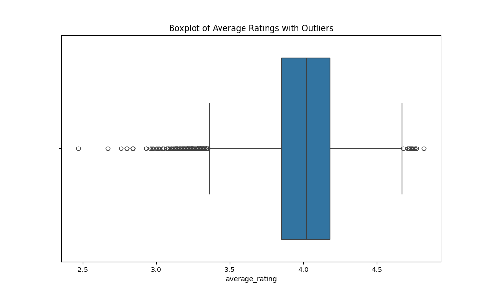

# Detailed Report

This report summarizes the analysis conducted on a dataset containing information about books and their ratings, as visualized through various graphs and calculated metrics.

## Descriptive Statistics

The dataset consists of **10,000 books**, featuring the following attributes:

- **book_id**: Unique identifier for each book
- **original_publication_year**: The year the book was originally published
- **average_rating**: Average rating received by the book
- **ratings_count**: Total number of ratings the book has received
- **work_ratings_count**: Ratings count for the work, not just the individual edition
- **work_text_reviews_count**: Total number of text reviews for the work
- **ratings_1 to ratings_5**: Count of ratings from 1 to 5 stars

### Summary Statistics for Ratings

| Statistic          | Value   |
| ------------------ | ------- |
| Count              | 10,000  |
| Mean (book_id)     | 5000.50 |
| Standard Deviation | 2886.90 |
| Minimum (book_id)  | 1       |
| Maximum (book_id)  | 10,000  |

### Outlier Detection

A boxplot analysis for average ratings revealed that there are **72 outliers** based on their average ratings, which were detected using the interquartile range (IQR) method.

### Yearly Average Ratings

The average ratings across different years span from **-1750** to **2017**. Key observations include:

- Ratings have been consistently above **3.5** in recent years with a notable increase post-2000.

### Correlation Analysis

The correlation matrix indicates relationships between various features. Some notable correlations are:

- **Ratings count** has a strong positive correlation with **work_ratings_count** (0.98) and with ratings across all star categories.
- A significant negative correlation exists between **book_id** and the average number of **ratings**.

### Regression Analysis

A regression analysis was performed to understand the relationship between **ratings count** and **average rating**. The regression line implies that as ratings count increases, the average rating also tends to increase.

- **Regression Coefficient**: \[7.27 \times 10^{-8}\]
- **Mean Squared Error (MSE)**: 0.0646

### Time Series Analysis

The time series analysis indicates a generally upward trend in average ratings from the early years to the present, suggesting improved ratings over time.

### Clustering Analysis

A clustering analysis demonstrated three distinct clusters based on ratings count and average rating:

1. **Cluster 0**: Lower ratings count with varying average ratings.
2. **Cluster 1**: Moderate ratings count with higher average ratings.
3. **Cluster 2**: Higher ratings count, where most books fall into this category with good average ratings.

### Conclusion

This analysis reveals trends in book ratings over time, highlights the presence of outliers, and demonstrates strong correlations between ratings features. The findings indicate an overall improvement in average ratings in recent years, alongside a clear relationship between the number of ratings received and the average rating.

The insights generated can be utilized to better understand reader preferences and guide future book selections or marketing strategies.

### Images Included

- 
- 
- 
- 
- 
