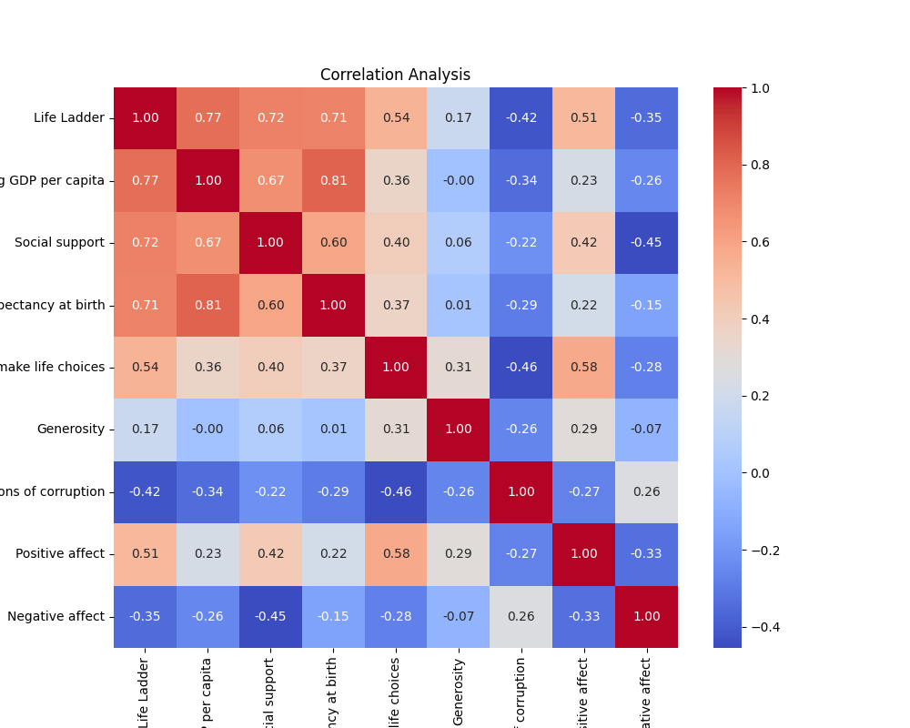

# Happiness Dataset Analysis Report

This report provides a detailed analysis of the happiness dataset, focusing on various aspects like outlier detection, correlation analysis, regression analysis, cluster analysis, and time series analysis.

## Outlier Detection
In the dataset, **122 outliers** were identified. Outliers can significantly skew the results of various analyses, hence, it’s essential to consider them when interpreting results.

## Correlation Analysis
A correlation matrix was generated to analyze the relationships between different variables. The generated heatmap provides a clear overview of how each variable correlates with others.

### Correlation Matrix Insights:
- **Life Ladder** has a strong positive correlation with:
  - Log GDP per capita (0.77)
  - Social support (0.54)
  - Freedom to make life choices (0.53)
  
- **Perceptions of corruption** showed a significant negative correlation with Life Ladder (-0.42).

The correlation heatmap is illustrated below:

## Regression Analysis
The regression analysis aimed to assess the impact of various factors on the Life Ladder. The regression coefficients were as follows:

- **Log GDP per capita**: 0.3520
- **Social support**: 2.7396
- **Healthy life expectancy at birth**: 0.0261
- **Freedom to make life choices**: 1.3424
- **Generosity**: 0.5381
- **Perceptions of corruption**: -0.5943
- **Intercept**: -2.2616

These coefficients suggest that Social support and Freedom to make life choices have a notably high positive influence on the Life Ladder, whereas Perceptions of corruption have a negative effect.

## Cluster Analysis
The cluster analysis was conducted using a Silhouette Score metrics, yielding a score of **0.52**, which indicates a moderate level of cluster separation. This score suggests that the clusters formed in the dataset are reasonably distinct.

The results of the cluster analysis are represented in the following plot:

## Time Series Analysis
A time series plot was generated to visualize the average Life Ladder over the years. The trend indicates fluctuations, with a noticeable decline around 2006 and upswing starting from 2015.

The time series plot is shown below:

## Conclusion
The analysis of the happiness dataset provides valuable insights into the factors influencing well-being across different countries. The results highlight the importance of social support and freedom to make life choices in enhancing people's happiness, while negative perceptions regarding corruption significantly detract from it. The outlier detection and cluster analysis further inform how well distinct groups perform in terms of happiness, which could guide policy and intervention strategies aimed at improving quality of life.

Overall, the data analysis process was completed successfully, revealing key trends and relationships within the dataset.