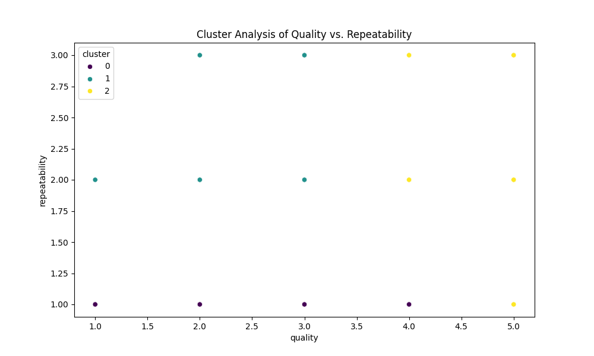
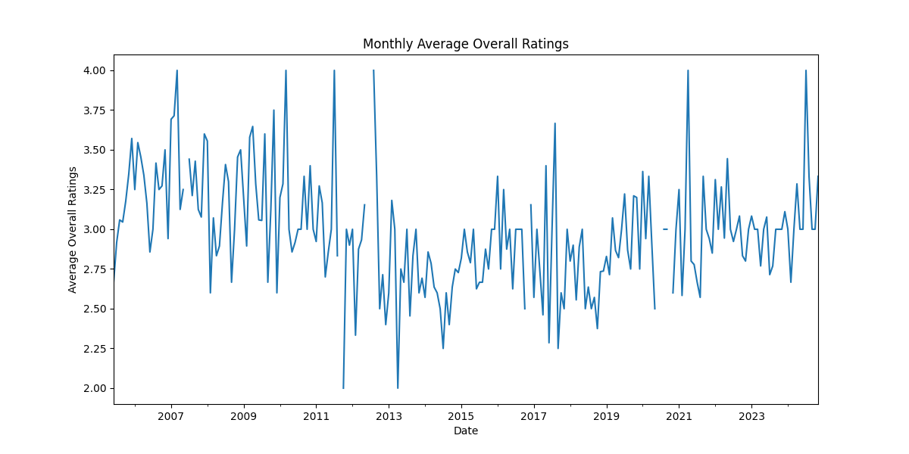
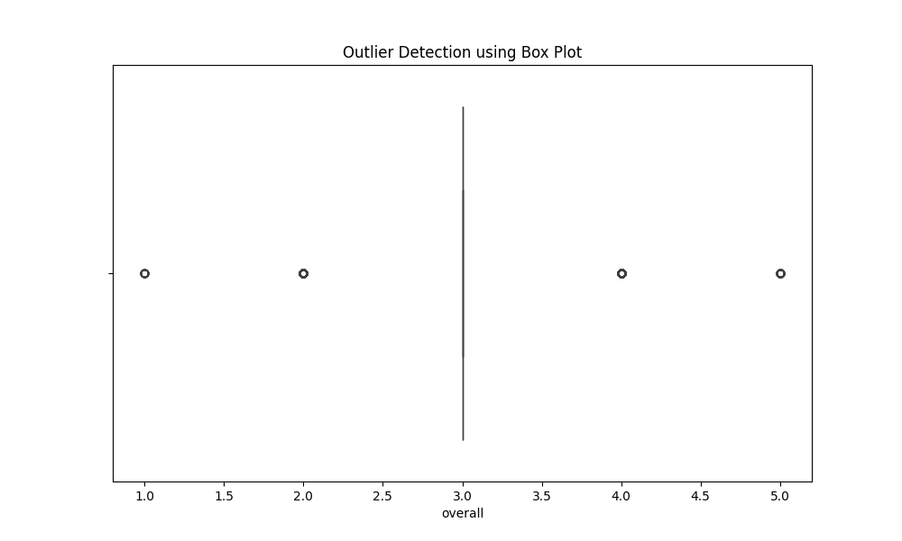
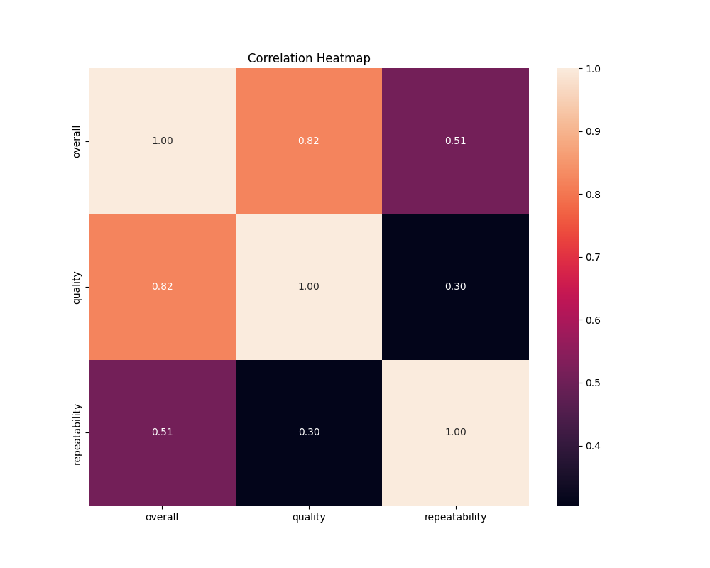

# Analysis Report

This report summarizes the data analysis conducted on a dataset of media ratings, focusing on cluster analysis, correlation analysis, outlier detection, and time series analysis. The findings and visual representations of the data are included for clarity.

## Descriptive Statistics

The dataset consists of 2553 records with the following features:

- **Date**
- **Language**
- **Type** (e.g., movie, series)
- **Title**
- **By**
- **Overall Rating**
- **Quality**
- **Repeatability**

### Summary Statistics

- **Overall Ratings:**
  - Mean: 3.03
  - Standard Deviation: 0.76
  - Minimum: 1.00
  - Maximum: 5.00
- **Quality:**
  - Mean: 3.19
  - Standard Deviation: 0.79
  - Minimum: 1.00
  - Maximum: 5.00
- **Repeatability:**
  - Mean: 1.48
  - Standard Deviation: 0.60
  - Minimum: 1.00
  - Maximum: 3.00

## Cluster Analysis with K-means

### Cluster Centers

The K-means clustering identified three distinct clusters with the following centers:

- Cluster 0: \([-0.31449421, -0.8077826]\)
- Cluster 1: \([-0.3854315, 0.99138607]\)
- Cluster 2: \([1.26207383, 1.04587931]\)

### Visualization

The scatter plot illustrates the clustering of quality versus repeatability:

## Time Series Analysis

### Monthly Average Overall Ratings

The average overall ratings were analyzed over time, revealing fluctuations from 2005 to 2024. The analysis shows a discernible trend in average ratings across the years:

## Outlier Detection Analysis

### Descriptive Statistics for Outliers

Outlier detection identified several records that diverged significantly from the overall trends:

- **Detected Outliers Examples:**
  - Date: **2024-11-15**, Title: *Meiyazhagan*, Overall: 4
  - Date: **2024-11-10**, Title: *Vettaiyan*, Overall: 2

### Box Plot Visualization

The following box plot visualizes the detected outliers for the overall ratings:

## Correlation Analysis

### Correlation Matrix

The correlation analysis revealed significant relationships among features:

| Feature        | Overall | Quality | Repeatability |
|----------------|---------|---------|---------------|
| Overall        | 1.00    | 0.82    | 0.51          |
| Quality        | 0.82    | 1.00    | 0.30          |
| Repeatability   | 0.51    | 0.30    | 1.00          |

### Mean Squared Error

The regression model's mean squared error was calculated at **0.1411**, indicating the fit's accuracy.

### Heatmap Visualization

The correlation heatmap provides a visual summary of these relationships:

## Conclusions

- The analysis successfully identified three distinct clusters in the quality and repeatability data.
- A clear trend in overall ratings over the years demonstrates shifts in audience perception.
- Outlier detection highlighted several instances that may require further investigation.
- Strong correlations between the overall ratings and quality suggest areas for potential improvement in content offerings.

This report provides a comprehensive view of the dataset and the analysis performed, offering insights into media ratings patterns and quality assessments.